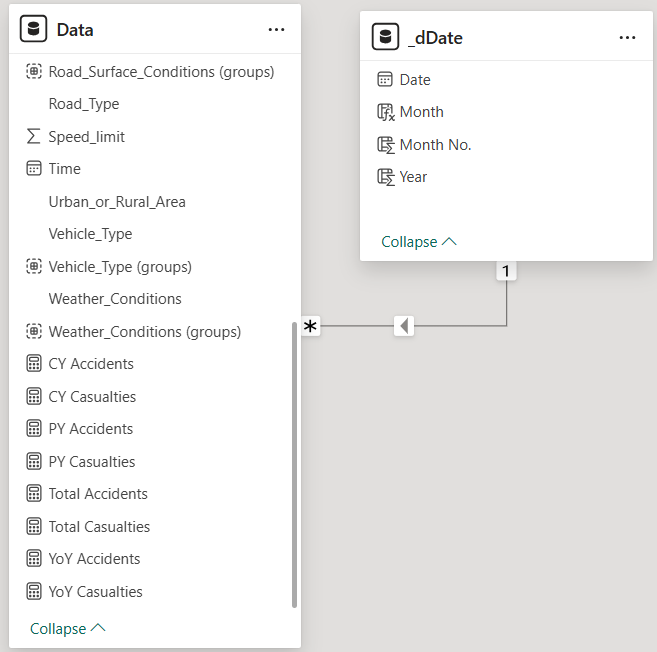
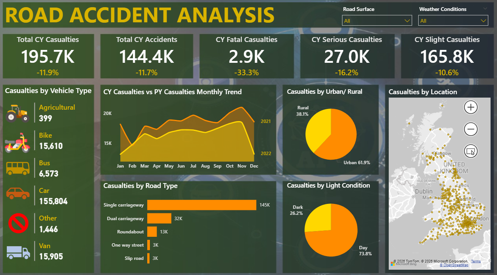
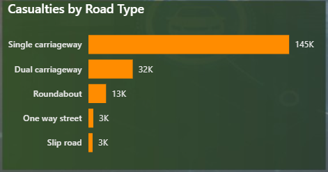
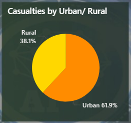
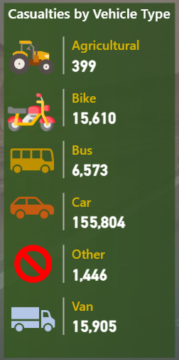
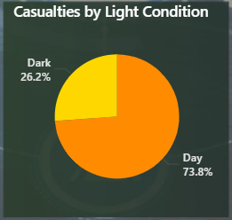

# Project Background & Overview
Road safety is a major concern for transport authorities. This project analyzes road accident data to identify where, when, and how accidents happen. By comparing current data to the previous year, the dashboard helps officials see if safety measures are working and which road types or weather conditions need more attention to save lives.

**Key Business Questions:**
* Are the total number of accidents and casualties increasing or decreasing compared to last year?
* Which vehicle types (Cars, Bikes, Vans) are involved in the most casualties?
* Do more accidents happen in the dark or during daylight? How do road types (Single vs. Dual carriageways) affect safety?
* Are Urban areas more dangerous than Rural areas, and where are the specific accident "hotspots" on the map?

# Data Structure Overview
The data is designed to track every accident event and the resulting victims (casualties).

* **Source:** Kaggle Public Dataset
* **Accident Details:** Severity (Fatal, Serious, Slight), Road Type, and Light Conditions.
* **Vehicle Data:** Type of vehicle involved (Car, Bus, Van, etc.).
* **Temporal Data:** Monthly trends for the current and previous years.
* **Geographic Data:** Urban vs. Rural classification and exact map coordinates.

**Entity Relationship Diagram (ERD):**

# Executive Summary
The dashboard shows a positive trend: Total casualties are down by **11.9%**, now sitting at **195.7K**. Fatalities have seen the biggest drop, decreasing by **33.3%**. Most accidents occur on **Single Carriageways** and during **Daylight**. Cars are the primary vehicle involved, and Urban areas remain the most common location for accidents (**61.9%**).

**High-Level Metrics**
* **Total CY Casualties**: 195.7K (Down 11.9%)
* **Total CY Accidents**: 144.4K (Down 11.7%)
* **Fatal Casualties**: 2.9K (Down 33.3%)
* **Serious Casualties**: 27.0K (Down 16.2%)
* **Slight Casualties**: 165.8K (Down 10.6%)

# Insights Deep Dive
### The "Single Carriageway" Danger Zone
* **145K casualties** happened on Single Carriageways, which is significantly higher than all other road types combined.
* This road type is the most dangerous. Safety efforts should be focused here rather than on slip roads or one-way streets.

### Urban vs. Rural Risk Profile
  * Urban areas account for **61.9%** of casualties, while Rural areas account for **38.1%**.
  * While Urban areas have more accidents, the severity often differs. High-volume traffic in cities leads to more frequent, though often less fatal, "slight" casualties.

### Vehicle Type: Cars are the Main Factor
* Cars are involved in **155,804** casualties, followed by Vans (**15.9K**) and Bikes (**15.6K**).
* Car-related safety should be the #1 priority. Interestingly, Bikes and Vans have very similar casualty counts despite having very different sizes.
  

### Light Conditions and Timing
* **73.8%** of accidents happen during the day, while only **26.2%** happen in the dark.
* Most accidents are not caused by poor visibility at night, but likely by high traffic volume and congestion during daylight hours.

# Recommendations
* **Single Carriageway Infrastructure**: Review speed limits and lane dividers on single carriageways to reduce the 145K casualty figure.
* **Urban Traffic Management**: Since **62%** of accidents are in Urban areas, implement better pedestrian crossings and traffic calming in cities.
* **Cycling Safety**: Even though bikes have lower numbers than cars, **15.6K** is high for vulnerable road users. Expand dedicated bike lanes to separate them from cars and vans.
* **Maintain Fatality Progress**: Investigate what caused the **33.3%** drop in fatal accidents this year and apply those successful tactics to reduce "Serious" and "Slight" categories as well.
